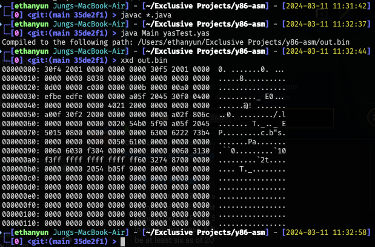

# y86 Assembler
*Tanisha, Ethan*

## Description
The specification for the y86 encoding is found [here](https://web.cse.ohio-state.edu/~reeves.92/CSE2421sp13/PracticeProblemsY86.pdf). The only difference is that registers and immediates are assumed to be 64 bit. The structure of the actual assembler is as follows,
<ol>
  <li><code>WordSplitter</code> splits the file up into words separated by whitespace</li>
  <li><code>WordTokenizer</code> groups up the words into individual <code>Token</code>s, which are either labels, instructions, or directives</li>
  <li><code>Assembler</code> runs the compile and linking of each <code>Token</code>
    <ol>
      <li><code>Token</code> compiles itself first using individual <code>Operand</code>s, excluding labels</li>
      <li><code>Token</code> links labels</li>
    </ol>
  </li>
</ol>

## Usage
To compile the assembler, do the following command in the root directory:
```
javac *.java
```
To run the assembler on some file <code>filename</code>, do the following command in the root directory:
```
java Main <filename>
```

## Example
The following is an output from running the command on [yasTest.yas](yasTest.yas).

